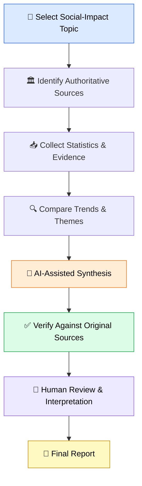

<div align="center">

# 🤖 AI-Powered Data Analysis

### The Impact of Artificial Intelligence on Education
*Opportunities · Trends · Responsible Use*

<br/>


<br/>

[📄 View Report](./report/AI-Powered%20Data%20Analysis%20The%20Impact%20of%20Artificial%20Intelligence%20on%20Education.pdf)&nbsp;•&nbsp;
[📚 **Sources**](./sources/SOURCES.md) &nbsp;•&nbsp;
[📂 **Full Internship Drive**](https://drive.google.com/drive/folders/1gFSRE4nI6DqWaAV-zipojbWrqJGOvlHJ?usp=drive_link)

</div>

---

## 🧭 Table of Contents

- [Overview](#-overview)
- [At a Glance](#-at-a-glance)
- [Key Findings](#-key-findings)
- [Emerging Trends](#-emerging-trends)
- [Opportunities vs. Challenges](#%EF%B8%8F-opportunities-vs-challenges)
- [Methodology](#-ai-assisted-methodology)
- [Recommendations](#-recommendations)
- [Sources](#-research-sources)
- [Repository Structure](#%EF%B8%8F-repository-structure)
- [Key Learning](#-key-learning)
- [Author](#-author)

---

## 📌 Overview

This project was completed as **Task 2 of my internship with [InAmigos Foundation](#-internship-details)**.

It examines how **Artificial Intelligence is reshaping education**, covering student adoption, institutional readiness, and the responsible, human-centered use of AI. The analysis combines research from authoritative organizations with **AI-assisted synthesis**, followed by **human verification and interpretation**.

> [!NOTE]
> AI was used as a *supporting tool*, not a source of truth. Every statistic in this report was checked against its original publication.

### 🎯 Task Objectives

| # | Objective |
|:-:|---|
| 1 | Select a relevant social-impact topic |
| 2 | Research it using reliable, authoritative sources |
| 3 | Collect and analyze statistics and trends |
| 4 | Use AI tools to assist research and analysis |
| 5 | Identify key findings and insights |
| 6 | Present results in a clear, concise report |
| 7 | Apply responsible research and source-verification practices |

---

## ⚡ At a Glance

<div align="center">

| 🎓 **75%** | 📱 **68%** | 🏫 **<10%** | 🌍 **1 in 3+** |
|:---:|:---:|:---:|:---:|
| of OECD students aged 16+ used Generative AI (2025) | of U.S. teens aged 15–17 used AI chatbots | of surveyed schools & universities had formal AI guidance | individuals across OECD countries used Generative AI (2025) |

</div>

> **Takeaway:** AI adoption is moving fast, while institutional guidance and responsible-use frameworks are still catching up.

---

## 📊 Key Findings

| Finding | Statistic | Source |
|---|---|---|
| 🎓 **Student AI adoption** | 75% of OECD students aged 16+ reported using Generative AI in 2025 | OECD |
| 📱 **Teen AI adoption** | 68% of U.S. teens aged 15–17 reported using AI chatbots | Pew Research Center |
| 🏫 **Institutional readiness** | Fewer than 10% of surveyed schools and universities had formal AI guidance | UNESCO |
| 🌍 **Population-wide use** | More than one-third of individuals across OECD countries used Generative AI in 2025 | OECD |

---

## 📈 Emerging Trends

<table>
<tr>
<td width="50%" valign="top">

### 1️⃣ From Experiment to Mainstream
Generative AI has moved beyond early experimentation and is now part of everyday learning and information-seeking.

</td>
<td width="50%" valign="top">

### 2️⃣ Personalized Learning
AI helps learners get tailored explanations, practice material, faster feedback, and different learning approaches.

</td>
</tr>
<tr>
<td width="50%" valign="top">

### 3️⃣ Rising Importance of AI Literacy
Students and educators need the skills to evaluate AI-generated information and use it responsibly.

</td>
<td width="50%" valign="top">

### 4️⃣ Governance Catching Up
Growing usage is pushing institutions to set clear policies, guidance, and responsible-use practices.

</td>
</tr>
</table>

---

## ⚖️ Opportunities vs. Challenges

<table>
<tr>
<th width="50%">✅ Opportunities</th>
<th width="50%">⚠️ Challenges</th>
</tr>
<tr>
<td valign="top">

- **Access** — wider reach to explanations and learning resources
- **Personalization** — support adapted to each learner
- **Faster feedback** — quicker practice and iteration
- **Inclusion** — tools that support different learner needs
- **Teacher capacity** — help with repetitive, time-consuming tasks

</td>
<td valign="top">

- **Privacy** and data protection
- **Bias** and inaccurate AI-generated information
- **Over-reliance** on AI tools
- **Academic integrity**
- **Lack of institutional guidance**
- **AI literacy gaps**

</td>
</tr>
</table>

---

## 🤖 AI-Assisted Methodology

AI supported the process, and humans owned the conclusions.

| 🤖 AI Contribution | 🧑 Human Responsibility |
|---|---|
| Synthesizing lengthy reports and webpages | Verifying claims against original sources |
| Organizing statistics into themes | Checking dates and definitions |
| Identifying common trends | Reviewing context and relevance |
| Drafting concise summaries | Editing the final report |
| Structuring findings and insights | Making final interpretations |

### 🔄 Research Workflow



---

## ✅ Recommendations

| | Recommendation | Why it matters |
|:-:|---|---|
| 🧠 | **Teach AI literacy, not just AI usage** | Students must learn to critically evaluate and responsibly use AI. |
| 🧑‍⚖️ | **Keep humans in the loop** | AI should support decisions and learning, not replace human judgment. |
| 🔐 | **Protect learner data** | Educational AI must prioritize privacy, security, and responsible data handling. |
| 👩‍🏫 | **Complement, don't replace, educators** | Human interaction, guidance, and mentorship remain essential. |

---

## 📚 Research Sources

| Organization | Publication |
|---|---|
| **OECD** | AI Use by Individuals Across the OECD |
| **OECD** | Digital Education Outlook 2026 |
| **Pew Research Center** | Teens, Social Media and AI Chatbots 2025 |
| **UNESCO** | Guidance for Generative AI in Education and Research |
| **UNESCO** | Survey on Formal AI Guidance in Schools and Universities |

👉 Full list with links: **[sources/SOURCES.md](./sources/SOURCES.md)**

---

## 🗂️ Repository Structure

```text
AI-Powered-Data-Analysis-Education/
├── README.md
├── report/
│   └── AI-Powered Data Analysis Report.pdf
└── sources/
    └── SOURCES.md
```

---

## 🎓 Key Learning

<div align="center">


</div>

---

## 📦 Project Deliverables

- [x] 📄 AI-Powered Data Analysis Report
- [x] 📚 Research sources and supporting material
- [x] 📊 Key statistics and findings
- [x] 💡 Insights and recommendations
- [x] 🤖 AI-assisted research methodology

---

## 🏢 Internship Details

| | |
|---|---|
| **Organization** | InAmigos Foundation |
| **Task** | Task 2 – AI-Powered Data Analysis |
| **Focus Area** | Social Impact & Education |
| **Date** | 7 October 2026 |
| **Full Work** | [📂 Google Drive folder](https://drive.google.com/drive/folders/1gFSRE4nI6DqWaAV-zipojbWrqJGOvlHJ?usp=drive_link) |

---

## 🙏 Acknowledgement

Thank you to **InAmigos Foundation** for the opportunity to build practical skills in research, data analysis, AI-assisted workflows, and social-impact documentation.

---

## 👨‍💻 Author

<div align="center">

### Priyam Singh

[](https://github.com/priyam-10)
[](https://www.linkedin.com/in/priyamsingh10/)
[](mailto:priyamsingh0017@gmail.com)

<br/>

### ⭐ Found this useful? Give it a star!

**Research • Analyze • Learn • Create Impact**

</div>
